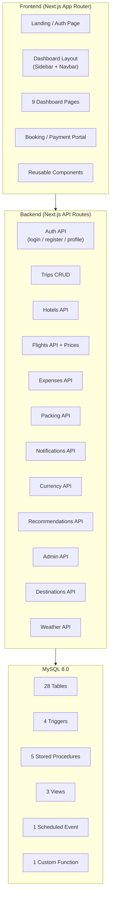
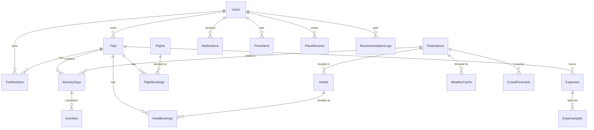

# TripPlanner Pro — Complete Project Overview

## 🎯 Project Summary

**TripPlanner Pro** is a full-stack trip management web application built as a **DBMS course project**. It showcases advanced MySQL 8.0 database features including triggers, stored procedures, views, events, and window functions — all wrapped in a polished, production-quality Next.js frontend.

| Property | Detail |
|----------|--------|
| **Name** | TripPlanner Pro |
| **Purpose** | DBMS Course Project |
| **Framework** | Next.js 16.2.4 (App Router) |
| **Language** | TypeScript |
| **Database** | MySQL 8.0 (via MariaDB adapter) |
| **ORM** | Prisma 7.8.0 |
| **Styling** | Tailwind CSS v4 |
| **Auth** | JWT (jose + bcryptjs) |
| **Status** | Functional, development stage |

---

## 🏗️ Architecture



---

## 📁 Project Structure

```
Trip management/
├── prisma/
│   ├── schema.prisma              # 28 models across 12 modules (522 lines)
│   ├── seed.ts                    # Database seeding logic
│   ├── seed-data.ts               # Sample data definitions
│   ├── advanced_db_objects.sql    # Triggers, SPs, Views, Events (535 lines)
│   ├── ddl_commands.sql           # CREATE TABLE statements
│   ├── dml_commands.sql           # INSERT sample data
│   ├── chapter4_normalization.sql # Normalization documentation
│   ├── report_queries.sql         # Demonstration queries
│   ├── er_diagram.drawio          # ER diagram (standard notation)
│   ├── er_diagram_chen.drawio     # ER diagram (Chen notation)
│   ├── generate_er_drawio.js      # ER diagram generator script
│   ├── generate_chen_er.js        # Chen ER diagram generator
│   └── migrations/                # Prisma migration files
│
├── src/
│   ├── app/
│   │   ├── layout.tsx             # Root layout (Poppins + Inter fonts)
│   │   ├── page.tsx               # Landing/Login page
│   │   ├── globals.css            # Design system (CSS variables + components)
│   │   ├── booking/page.tsx       # Checkout & payment portal
│   │   │
│   │   ├── dashboard/
│   │   │   ├── layout.tsx         # Dashboard shell (sidebar + navbar)
│   │   │   ├── page.tsx           # Dashboard home
│   │   │   ├── trips/             # Trip list, detail, create new
│   │   │   ├── hotels/            # Hotel browsing & booking
│   │   │   ├── flights/           # Flight search & booking
│   │   │   ├── expenses/          # Expense tracking & splits
│   │   │   ├── packing/           # Packing list manager
│   │   │   ├── notifications/     # Notification center
│   │   │   ├── recommendations/   # AI-powered discover page
│   │   │   ├── profile/           # User profile settings
│   │   │   └── admin/             # Admin analytics dashboard
│   │   │
│   │   └── api/                   # 12 API route modules
│   │       ├── auth/[action]/     # Login, register, profile
│   │       ├── trips/             # CRUD + [id] routes
│   │       ├── hotels/            # Hotel search & booking
│   │       ├── flights/           # Flights + prices sub-route
│   │       ├── expenses/          # Expense management
│   │       ├── packing/           # Packing list
│   │       ├── notifications/     # Notification fetch & mark read
│   │       ├── currency/          # Currency conversion
│   │       ├── recommendations/   # AI recommendations
│   │       ├── admin/             # Admin statistics
│   │       ├── destinations/      # Destination lookup
│   │       └── weather/           # Weather forecast
│   │
│   ├── components/
│   │   └── PaymentModal.tsx       # Reusable payment modal with states
│   │
│   ├── context/
│   │   └── AuthContext.tsx         # Auth + theme + currency provider
│   │
│   ├── lib/
│   │   ├── prisma.ts              # Prisma client (MariaDB adapter)
│   │   ├── auth.ts                # JWT sign/verify + bcrypt
│   │   └── currency.ts            # Currency conversion helpers
│   │
│   └── generated/                 # Prisma generated client
│
├── .env                           # Database URL, JWT secret, API URLs
├── package.json
├── implementation_plan.md         # Original design document
└── next.config.ts
```

---

## 🗄️ Database Schema — 12 Modules, 28 Tables



### Module Breakdown

| # | Module | Tables | Key Features |
|---|--------|--------|-------------|
| 1 | **User Management** | `users` | Email/password auth, admin flag, preferred currency |
| 2 | **Trip Planning** | `trips`, `trip_members` | CRUD, member roles, cost sharing, status tracking |
| 3 | **Destinations & Itinerary** | `destinations`, `itinerary_days`, `activities` | Day-by-day planning, geo coordinates, activity categories |
| 4 | **Accommodation** | `hotels`, `hotel_bookings`, `group_discounts` | Rating-based search, group discount triggers, JSON amenities |
| 5 | **Flights** | `flights`, `flight_bookings`, `flight_price_history`, `price_alerts` | Price tracking, booking advice, PNR generation |
| 6 | **Notifications** | `notifications` | System, price alerts, trip reminders — with read/unread status |
| 7 | **Packing** | `packing_templates`, `packing_items`, `weather_item_mapping`, `activity_item_mapping`, `trip_packing_items` | Auto-generated lists based on weather + activities |
| 8 | **Admin Analytics** | `admin_stats_cache` | Cached aggregated stats (replaces materialized view) |
| 9 | **Currency** | `exchange_rates` | Multi-currency conversion with cached rates |
| 10 | **Group Budget** | `expenses`, `expense_splits` | Auto-splitting, settlement tracking |
| 11 | **Weather** | `weather_cache` | Cached forecasts per destination + date |
| 12 | **AI Suggestions** | `user_preferences`, `crowd_forecasts`, `place_reviews`, `recommendation_logs` | Score-based recommendations using reviews, crowds, weather |

---

## ⚡ Advanced Database Objects

### 4 Triggers

| Trigger | Table | Timing | What It Does |
|---------|-------|--------|-------------|
| `trg_apply_group_discount` | `hotel_bookings` | BEFORE INSERT | If trip has ≥3 members, applies the matching group discount to `total_price` |
| `trg_price_drop_notification` | `flight_price_history` | AFTER INSERT | Checks `price_alerts` and creates notifications when price drops below target |
| `trg_auto_split_expense` | `expenses` | AFTER INSERT | Auto-creates equal `expense_splits` rows for all trip members |
| `trg_update_currency_log` | `exchange_rates` | AFTER UPDATE | Notifies users whose preferred currency was affected by the rate change |

### 5 Stored Procedures

| Procedure | Input | Purpose |
|-----------|-------|---------|
| `GetCheapBookingAdvice(route_key)` | Route identifier | Analyzes `flight_price_history` to recommend optimal booking windows (uses `RANK()` window function) |
| `GeneratePackingList(trip_id)` | Trip ID | Joins weather forecasts + activity types to suggest packing items |
| `SuggestBudgetSavings(trip_id)` | Trip ID | Identifies shared accommodation & group transport savings |
| `RecommendDestinations(user_id)` | User ID | Scores destinations using: rating (40%) + crowd level (30%) + weather match (30%) |
| `sp_refresh_admin_stats()` | None | Populates `admin_stats_cache` with aggregated analytics (popular destinations, revenue, retention, budget vs actual) |

### 3 Views

| View | Purpose |
|------|---------|
| `v_upcoming_trips` | Trips starting within 30 days with member count, total spent, days until departure |
| `v_group_balance` | Net balance per member per trip (total paid – total owed) |
| `v_trip_itinerary_full` | Hierarchical join: Trip → Days → Destinations → Activities |

### 1 Event + 1 Function

| Object | Purpose |
|--------|---------|
| `refresh_admin_stats_event` | Daily scheduled event that calls `sp_refresh_admin_stats()` |
| `fn_convert(amount, from, to)` | Currency conversion function using `exchange_rates` table |

---

## 🎨 Frontend Design System

### Color Palette
| Token | Color | Hex | Usage |
|-------|-------|-----|-------|
| Primary | Deep Teal | `#0F4C5C` | Sidebar, buttons, headings |
| Secondary | Warm Orange | `#F4A261` | Accents, active states, highlights |
| Accent | Gold | `#E9C46A` | Special emphasis |
| Success | Seafoam | `#2A9D8F` | Status badges, positive indicators |
| Danger | Coral | `#E76F51` | Errors, delete actions |

### Typography
- **Headings**: Poppins (400–700 weights)
- **Body**: Inter (400–600 weights)

### UI Components (CSS Classes)
- `.btn-primary`, `.btn-secondary`, `.btn-danger`, `.btn-ghost` — Button variants with hover animations
- `.card` — White cards with shadow, hover lift effect
- `.input-field` — Styled inputs with focus ring
- `.badge`, `.badge-primary`, `.badge-success`, `.badge-warning`, `.badge-danger` — Status pills
- `.sidebar-link` — Navigation links with active state
- `.fade-in`, `.slide-up` — Entry animations
- `.notification-pulse` — Pulsing ring animation for unread notifications

### Features
- ✅ **Dark mode** (CSS variable swap via `.dark` class)
- ✅ **Responsive** (mobile sidebar overlay, stacked layouts)
- ✅ **Currency switcher** (7 currencies: USD, EUR, GBP, INR, JPY, AUD, CAD)
- ✅ **Micro-animations** (card hover, button lift, fade-in, slide-up, notification pulse)

---

## 🔐 Authentication System

| Layer | Implementation |
|-------|---------------|
| **Password hashing** | `bcryptjs` with 12 salt rounds |
| **Token** | JWT via `jose` library, HS256, 7-day expiry |
| **Client state** | React Context (`AuthProvider`) with `localStorage` persistence |
| **API protection** | `Bearer` token extraction from `Authorization` header |
| **Route protection** | Dashboard layout redirects to `/` if not authenticated |
| **Admin access** | `isAdmin` flag on user, extra nav items for admin users |

### Demo Credentials
- **Admin**: `admin@tripplanner.com` / `password123`
- **User**: `alice@example.com` / `password123`

---

## 🔌 External API Integrations

| API | Purpose | Auth |
|-----|---------|------|
| [Open-Meteo](https://api.open-meteo.com) | Weather forecasts | None (free, no key) |
| [ExchangeRate-API](https://open.er-api.com) | Currency rates | None (free tier) |
| [Unsplash](https://unsplash.com) | Static travel images | None (direct URLs in seed) |

---

## 📦 Key Dependencies

| Package | Version | Purpose |
|---------|---------|---------|
| `next` | 16.2.4 | Full-stack React framework |
| `react` / `react-dom` | 19.2.4 | UI library |
| `@prisma/client` + `@prisma/adapter-mariadb` | 7.8.0 | ORM with MariaDB adapter |
| `jose` | 6.2.2 | JWT signing/verification |
| `bcryptjs` | 3.0.3 | Password hashing |
| `lucide-react` | 1.11.0 | SVG icon library |
| `recharts` | 3.8.1 | Admin dashboard charts |
| `node-cron` | 4.2.1 | Scheduled tasks (rate refresh) |
| `tailwindcss` | v4 | Utility-first CSS |

---

## 📊 Dashboard Pages (9 Sections)

| Page | Route | Description |
|------|-------|-------------|
| **Dashboard Home** | `/dashboard` | Welcome screen, trip stats, trip cards, quick actions |
| **My Trips** | `/dashboard/trips` | List all trips with status, dates, member avatars |
| **New Trip** | `/dashboard/trips/new` | Create trip form |
| **Trip Detail** | `/dashboard/trips/[id]` | Full trip view with itinerary, bookings, expenses |
| **Hotels** | `/dashboard/hotels` | Browse/book hotels with payment modal |
| **Flights** | `/dashboard/flights` | Flight search, booking, price advisor |
| **Expenses** | `/dashboard/expenses` | Expense tracker with auto-split, balance view |
| **Packing** | `/dashboard/packing` | Smart packing list with check/uncheck |
| **Notifications** | `/dashboard/notifications` | Notification center with unread badge (30s polling) |
| **Discover** | `/dashboard/recommendations` | AI-powered destination recommendations |
| **Profile** | `/dashboard/profile` | User settings, currency preference |
| **Admin** | `/dashboard/admin` | Analytics dashboard (admin-only) |

---

## 🔧 Available Scripts

```bash
npm run dev          # Start development server (Next.js)
npm run build        # Production build
npm run start        # Start production server
npm run lint         # ESLint
npm run seed         # Run Prisma database seeder
```

### Database Setup
```bash
npx prisma migrate dev    # Apply migrations
npx prisma db seed        # Seed sample data
npx prisma studio         # Open database GUI
```

### Advanced DB Objects
```bash
mysql -u root -p trip_planner < prisma/advanced_db_objects.sql
```

---

## 📈 Academic Deliverables (Already Generated)

| File | Purpose |
|------|---------|
| [schema.prisma](file:///c:/Users/gokul/Downloads/Projects/Trip%20management/prisma/schema.prisma) | Complete 28-table schema definition |
| [ddl_commands.sql](file:///c:/Users/gokul/Downloads/Projects/Trip%20management/prisma/ddl_commands.sql) | All CREATE TABLE statements |
| [dml_commands.sql](file:///c:/Users/gokul/Downloads/Projects/Trip%20management/prisma/dml_commands.sql) | Sample INSERT data |
| [advanced_db_objects.sql](file:///c:/Users/gokul/Downloads/Projects/Trip%20management/prisma/advanced_db_objects.sql) | Triggers, procedures, views, events |
| [chapter4_normalization.sql](file:///c:/Users/gokul/Downloads/Projects/Trip%20management/prisma/chapter4_normalization.sql) | Normalization analysis |
| [report_queries.sql](file:///c:/Users/gokul/Downloads/Projects/Trip%20management/prisma/report_queries.sql) | Demonstration queries |
| [er_diagram.drawio](file:///c:/Users/gokul/Downloads/Projects/Trip%20management/prisma/er_diagram.drawio) | ER diagram (standard) |
| [er_diagram_chen.drawio](file:///c:/Users/gokul/Downloads/Projects/Trip%20management/prisma/er_diagram_chen.drawio) | ER diagram (Chen notation) |
